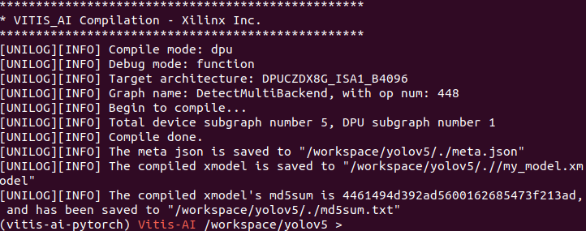
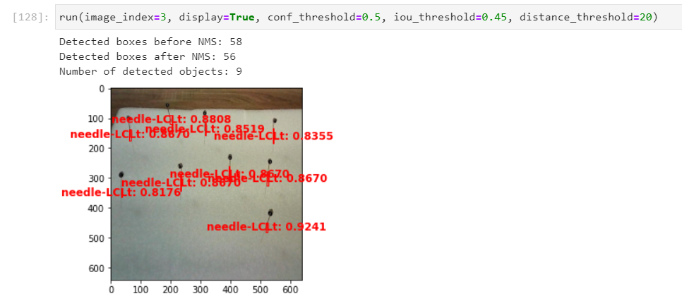

# YOLOv5-on-Pynq-ZU

This repository contains the implementation and deployment of YOLOv5 on the Pynq-ZU FPGA board using Vitis AI.

## Table of Contents

- [Introduction](#introduction)
- [Features](#features)
- [Requirements](#requirements)
- [Setup](#setup)
- [Model Preparation](#model-preparation)
- [Deployment](#deployment)
- [Usage](#usage)
- [Optimization](#optimization)
- [Results](#results)
- [Acknowledgments](#acknowledgments)

## Introduction

YOLOv5 is a state-of-the-art object detection model, and this project demonstrates how to deploy it on the Pynq-ZU FPGA board using Vitis AI to achieve real-time inference with hardware acceleration.

## Features

- Deployment of YOLOv5 on Pynq-ZU FPGA
- Custom modification of YOLOv5 to replace SiLU with Leaky ReLU for FPGA compatibility
- Quantization and optimization using Vitis AI
- Real-time object detection with low latency

## Requirements

- Pynq-ZU FPGA Board
- Vitis AI 1.4 or later
- Python 3.7 or later
- PyTorch for model conversion
- ONNX for intermediate model representation
- Xilinx's tools for compilation

## Setup

1. **Install Vitis AI:** Follow the official Xilinx documentation to install Vitis AI on your host machine and configure it on the Pynq-ZU board.
2. **Clone the Repository:**
    ```bash
    git clone https://github.com/your-username/YOLOv5-on-Pynq-ZU.git
    cd YOLOv5-on-Pynq-ZU
    ```
3. **Set Up the Environment:** Ensure all dependencies are installed and the environment is configured.

## Model Preparation
very important
1. Modify the Activation Function
Locate the activation functions in the YOLOv5 codebase. These are typically defined in the models/common.py file, where the SiLU function is used.
Replace instances of the SiLU activation function with LeakyReLU. 

## Deployment

1. **Compile the Model:**
    - Use the Vitis AI compiler to target the DPU architecture on the Pynq-ZU.
2. **Transfer and Deploy:**
    - Transfer the compiled model to the Pynq-ZU and deploy it using the provided Python scripts.

## Usage

1. **Run Inference:**
    - Use the `run_inference.py` script to perform object detection on your input data.
    - Example:
      ```bash
      python run_inference.py --image-path /path/to/image.jpg
      ```

## Optimization

- Fine-tune parameters such as batch size and frequency settings for optimal performance.
- Adjust the Leaky ReLU settings in the `models/common.py` for better performance on the FPGA.

## Results

- Provide benchmarks and results of the deployment, including inference time, accuracy, and power consumption.


## Acknowledgments

- List any resources, libraries, or contributors you wish to acknowledge.
